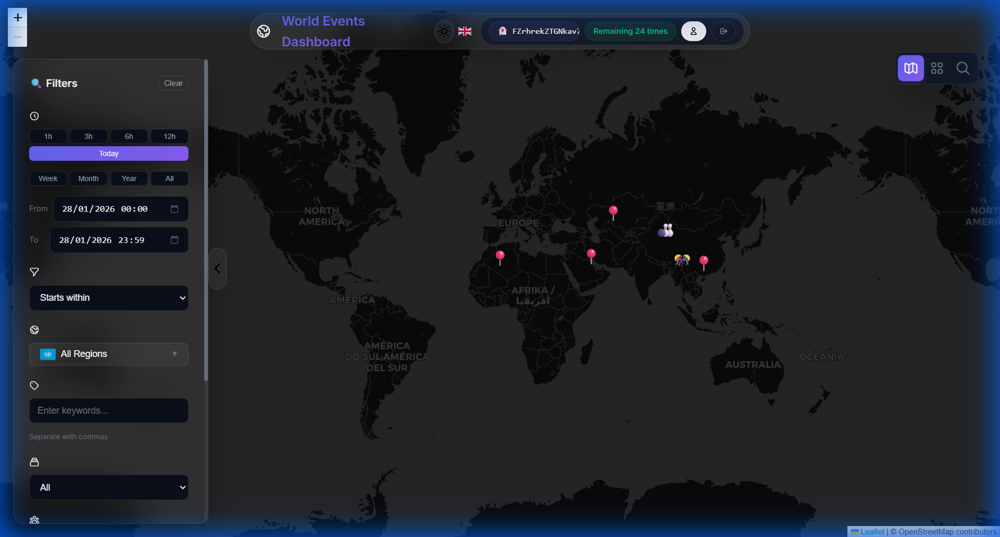
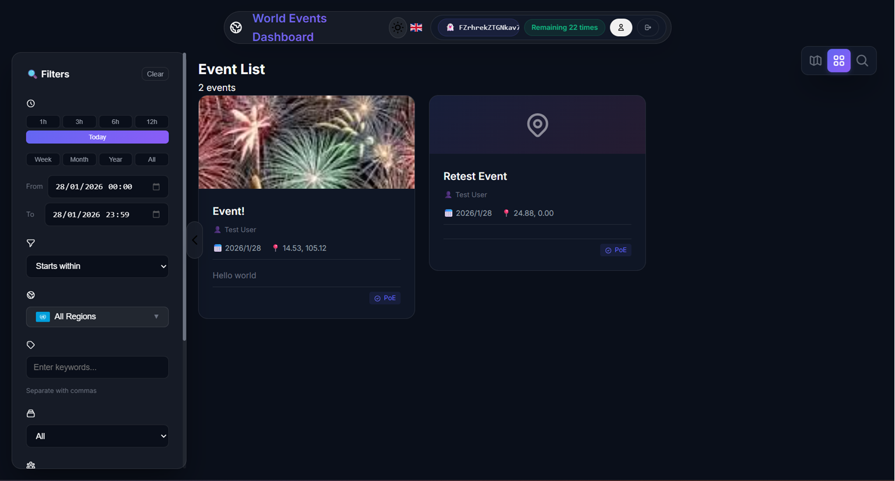
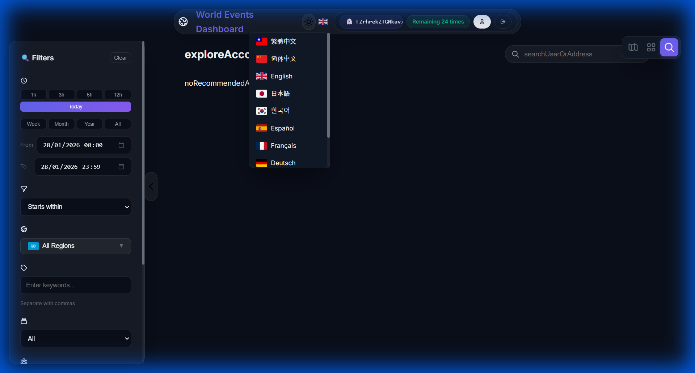

# 🌍 World Events Dashboard (Solana Edition)

> **Decentralized Event Tracking System powered by Solana & Phantom Wallet**


[](https://worldevents.devents.tech/)

> 🚀 **Live Demo for Solana Event:** [https://worldevents.devents.tech/](https://worldevents.devents.tech/)
> Youtube video Demo : https://www.youtube.com/watch?v=d7KggUksrnY

[English](README.md) | [中文](README_ZH.md)

## 💡 About The Project

World Events Dashboard is a community-driven, interactive platform where users can explore, create, and manage events on a global map. Built for the **Solana Event**, it bridges Web2 usability with Web3 identity.

**Why Solana?**
We chose Solana for three critical reasons essential for a **Decentralized Event Network**:

1.  **🚫 Censorship Resistance & Proof of Event (PoE)**:
    Events are stored safely on-chain or IPFS, creating an immutable **"Proof of Event"**.
    > *"Once it's on-chain, history cannot be rewritten."*

2.  **💸 Creator Economy (創作者經濟)**:
    Direct **P2P Tipping** with 0% platform fees.
    Unlike Web2 platforms taking 30%, we use Solana to ensure 100% of the value goes to the creator.

3.  **⚡ High Speed & Low Cost**:
    Instant event usage and micro-tipping (0.0001 SOL) made possible only by Solana's low gas fees.

## ✨ Key Features

- **🔐 Web3 Auth**: Instant login securely with Phantom Wallet.
- **🗺️ Interactive Map**: Real-time visualization of global events using Leaflet.js.
- **👤 Decentralized Profile**:
  - Set a **Display Name** linked to your wallet.
  - Manage **Subscriptions** to other creators on-chain.
  - **Official Wallet Sync**: Verified "Official" badges synced securely from server config.
- **🌍 Internationalization**: Fully localized in **10 languages** (English, Chinese, Japanese, Korean, Spanish, French, German, Portuguese, Russian).
- **📱 Responsive UI**: Beautiful, mobile-friendly interface with Dark/Light mode adaptation.
- **🔍 Advanced Filtering**:
  - Filter by **Event Source** (Official, Subscribed, or My Events).
  - Search by specific **Creator Name** or **Wallet Address**.
- **🔗 Social Integration**: Connect your Discord, Telegram, YouTube, X (Twitter), and Facebook.

## 📸 Screenshots

| Map View | Event List |
|----------|------------|
|  |  |

| Multi-Language Support |
|------------------------|
|  |

## 🚀 Quick Start (Judge's Guide)

The easiest way to run the project is using Docker.

### Prerequisites
- Docker & Docker Compose
- [Phantom Wallet Extension](https://phantom.app/) installed in your browser.

### 1. Clone & Configure
```bash
git clone https://github.com/Wing9897/worldevents.git
cd worldevents

# Create environment config
cp .env.example .env

# (Optional) Edit .env to set OFFICIAL_WALLETS or SOCIAL_LINKS
# Default settings work out-of-the-box for testing!
```

### 2. Launch
```bash
docker-compose up -d --build
```
> Wait ~10 seconds for the containers to initialize.

### 3. Explore
Open **[http://localhost:9333](http://localhost:9333)** in your browser.

- **Click "Connect Wallet"** (top right) to login.
- **Right-click on the map** to create your first event!
- **Click "Management Center"** to edit your profile.

---

## 🛠️ Tech Stack

- **Blockchain**: Solana Web3.js, Phantom Wallet adapter
- **Frontend**: HTML5, CSS3, Vanilla JS (ES6+), Leaflet.js
- **Backend**: Python (Flask), Gunicorn
- **Database**: SQLite (with SQLAlchemy-style schema), parameterized queries for security
- **Infrastructure**: Docker, Nginx

## 🔒 Security Highlights

- **No Secrets in Code**: All sensitive configs managed via `.env`.
- **SQL Injection Proof**: 100% parameterized database queries.
- **XSS Protection**: Strict use of `.textContent` for user inputs.
- **RBAC**: Role-based access control (User, Verified, Official) enforced by backend.

## ⚠️ Disclaimer

This project was built for the **Solana Event** as a proof-of-concept. While we have implemented standard security practices (JWT, Parameterized Queries, etc.), it has **not** undergone a professional security audit. 

**Use at your own risk.** We recommend using this for educational purposes or hackathon demonstrations only. Do not use for production-grade financial applications without further auditing.

## 📜 License

Distributed under the MIT License. See `LICENSE` for more information.

---
*Built with ❤️ for the Solana Community*
