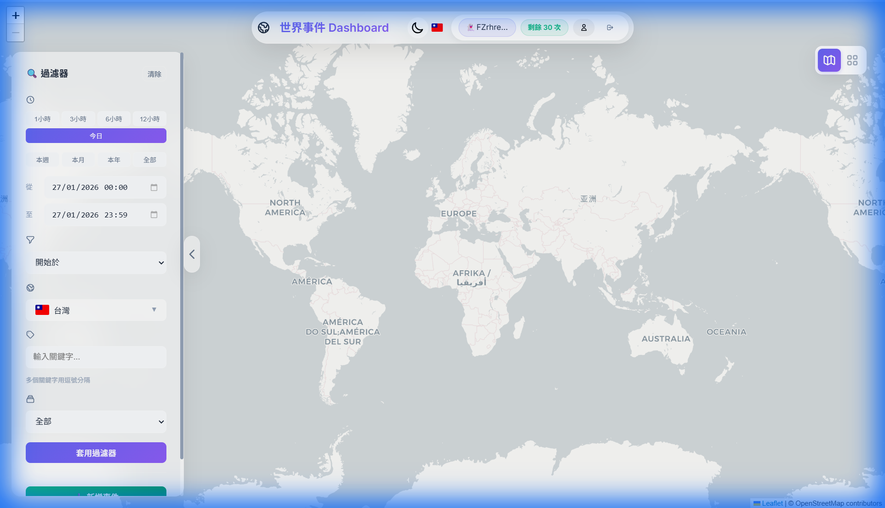

# 🌍 世界事件儀表板 (World Events Dashboard - Solana Edition)

> **基於 Solana 區塊鏈與 Phantom 錢包的去中心化事件追蹤系統**




[](https://worldevents.devents.tech/)

> 🚀 **Solana Student Hackathon 線上演示:** [https://worldevents.devents.tech/](https://worldevents.devents.tech/)
> Youtube 演示影片 : https://www.youtube.com/watch?v=d7KggUksrnY

[English](README.md) | [中文](README_ZH.md)

## 💡 關於專案

**世界事件儀表板 (World Events Dashboard)** 是一個社群驅動的互動平台，用戶可以在全球地圖上探索、創建和管理事件。本專案專為 **Solana Student Hackathon** 打造，旨在連接 Web2 的易用性與 Web3 的去中心化身份。

**為什麼選擇 Solana？**
我們選擇 Solana 作為 **去中心化事件網絡** 的核心，基於以下三個關鍵原因：

1.  **🚫 抗審查與事件證明 (PoE)**：
    所有事件均安全地存儲於鏈上或 IPFS，創建不可篡改的 **「事件證明 (Proof of Event)」**。
    > *"防止國家級別的歷史修正主義。一旦上鏈，歷史將無法被改寫。"*

2.  **💸 創作者經濟 (Creator Economy)**：
    實現 **P2P 直接打賞**，平台 0% 抽成。
    不同於 Web2 平台收取 30% 手續費，我們利用 Solana 確保 100% 的價值直接歸屬於創作者。

3.  **⚡ 高速與低成本**：
    Solana 極低的 Gas 費用使得即時事件發布和微額打賞 (0.0001 SOL) 成為可能。

## ✨ 核心功能

- **🔐 Web3 身份認證**：使用 Phantom 錢包安全且即時登入。
- **🗺️ 互動式地圖**：使用 Leaflet.js 實時可視化全球事件。
- **👤 去中心化個人檔案**：
  - 設定與您的錢包關聯的 **顯示名稱**。
  - 在鏈上管理對其他創作者的 **訂閱**。
  - **官方錢包同步**：從伺服器配置安全同步經過驗證的「官方認證」徽章。
- **🌍 國際化支援**：完整支援 **10 種語言** (英語、中文、日語、韓語、西班牙語、法語、德語、葡萄牙語、俄語)。
- **📱 響應式介面 (RWD)**：精美的手機版介面，並支援深色/淺色模式切換。
- **🔍 進階過濾功能**：
  - 支援依 **事件來源** 篩選 (官方、已訂閱、我的事件)。
  - 支援依特定 **創作者名稱** 或 **錢包地址** 搜尋。
- **🔗 社群整合**：連結您的 Discord, Telegram, YouTube, X (Twitter) 和 Facebook 帳號。

## 🚀 快速開始 (評審指南)

使用 Docker 是運行本專案最簡單的方式。

### 前置需求
- Docker & Docker Compose
- 瀏覽器需安裝 [Phantom Wallet Extension](https://phantom.app/)

### 1. 下載與配置
```bash
git clone https://github.com/your-username/worldevents.git
cd worldevents

# 建立環境變數配置
cp .env.example .env

# (可選) 編輯 .env 以設定 OFFICIAL_WALLETS 或 SOCIAL_LINKS
# 預設設定即可直接用於測試！
```

### 2. 啟動
```bash
docker-compose up -d --build
```
> 等待約 10 秒鐘讓容器初始化。

### 3. 開始探索
在瀏覽器中打開 **[http://localhost:9333](http://localhost:9333)**。

- 點擊 **"Connect Wallet"** (右上方) 進行登入。
- **在地圖上點擊右鍵** 即可創建您的第一個事件！
- 點擊 **"管理中心 (Management Center)"** 編輯您的個人資料。

---

## 🛠️ 技術棧 (Tech Stack)

- **區塊鏈**: Solana Web3.js, Phantom Wallet adapter
- **前端**: HTML5, CSS3, Vanilla JS (ES6+), Leaflet.js
- **後端**: Python (Flask), Gunicorn
- **資料庫**: SQLite (搭配 SQLAlchemy 風格架構), 參數化查詢確保安全
- **基礎設施**: Docker, Nginx

## 🔒安全性亮點

- **代碼中無機密**: 所有敏感配置均透過 `.env` 管理。
- **防 SQL 注入**: 100% 使用參數化資料庫查詢。
- **防 XSS 攻擊**: 嚴格使用 `.textContent` 處理用戶輸入。
- **RBAC 權限控制**: 由後端強制執行基於角色的存取控制 (由用戶、認證用戶、官方)。

## ⚠️ 免責聲明

本專案是為了 **Solana Student Hackathon** 建立的概念驗證 (PoC) 原型。雖然我們實施了標準的安全措施（如 JWT、參數化查詢等），但尚未經過專業的安全審計。

**使用風險自負。** 我們建議僅將其用於教育目的或黑客松演示。在未經進一步審計的情況下，請勿用於生產級的金融應用。

## 📜 授權 (License)

本專案採用 MIT 授權條款分發。詳情請參閱 `LICENSE` 文件。

---
*Built with ❤️ for the Solana Community*
